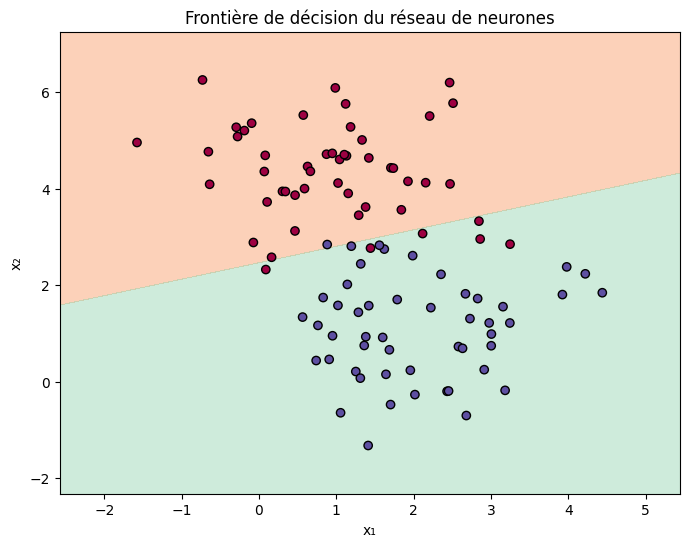

# 🧠 NeuralNetworkFromScratch

Ce projet implémente un **réseau de neurones simple** entièrement codé à la main en Python avec NumPy, sans utiliser de bibliothèques de deep learning comme TensorFlow ou PyTorch.

Il permet de :
- Comprendre les étapes fondamentales d’un réseau de neurones
- Visualiser l’apprentissage du modèle en 2D
- Observer en temps réel l’évolution de la frontière de décision

---

## 🎯 Objectifs du projet

- Coder un réseau de neurones **from scratch**
- Apprendre à :
  - Initialiser des poids
  - Propager les données (forward propagation)
  - Calculer les gradients (backpropagation)
  - Mettre à jour les poids (descente de gradient)
- Visualiser la frontière de décision évolutive

---

## 📷 Aperçu



---

## 🛠️ Technologies utilisées

| Outil             | Utilisation                          |
|------------------|---------------------------------------|
| Python            | Langage principal                    |
| NumPy             | Calcul matriciel                     |
| Matplotlib        | Visualisation                        |
| Scikit-learn      | Génération de données (`make_blobs`) |
| IPython.display   | Animation dynamique                  |

---

## 📁 Structure du projet

```bash
📦 NeuralNetworkFromScratch/
├── neural_network.ipynb    # Le notebook principal
├── demo.png               # Animation de la frontière de décision
└── README.md               # Ce fichier
